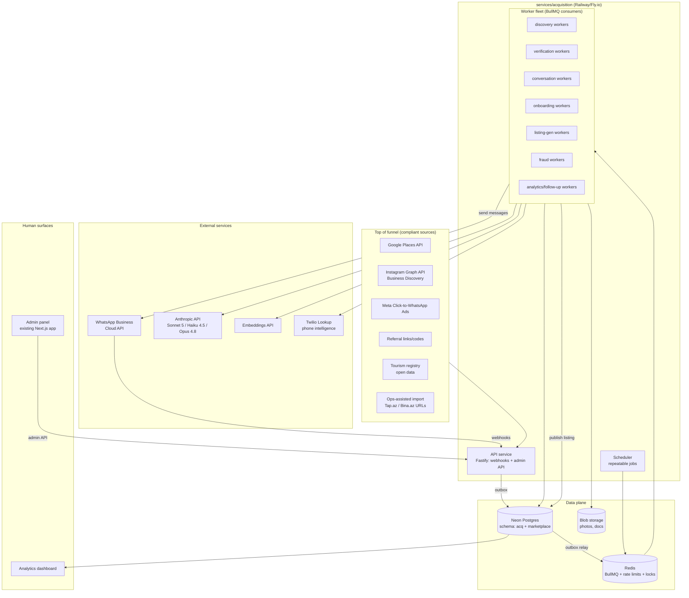
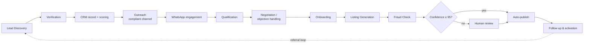
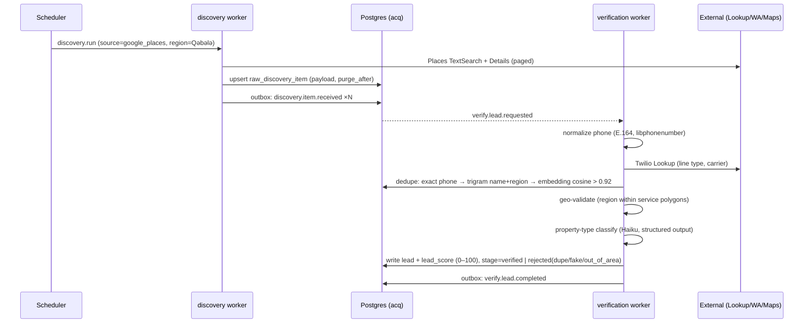
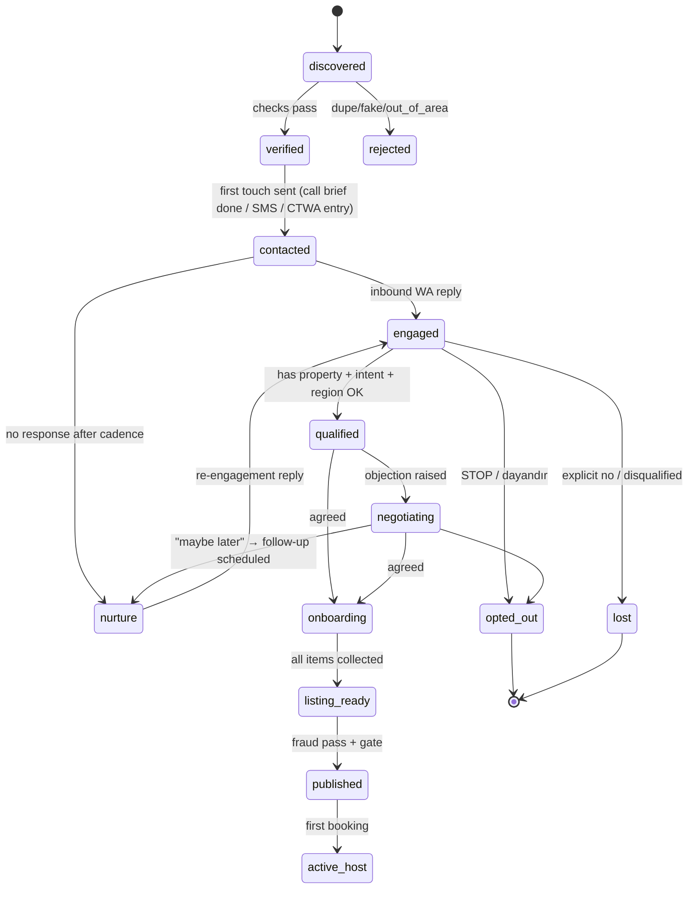
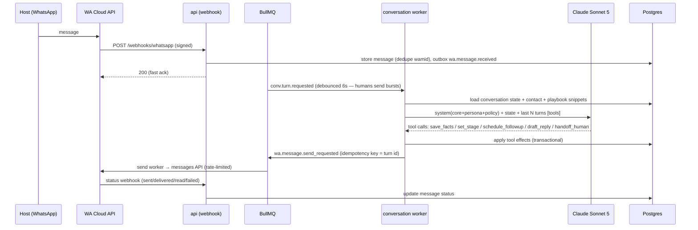
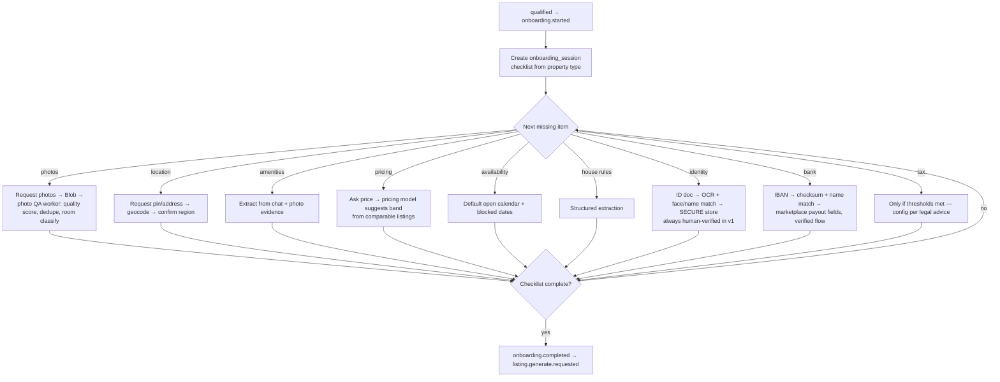
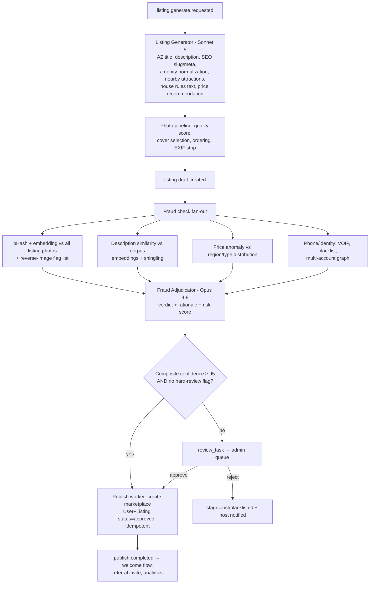

# 01 — System Architecture

## 1. Context: what already exists

The Gecələ marketplace is a Next.js 14 app on Vercel with Neon Postgres (eu-central-1, PgBouncer pooling), Vercel Blob for media, phone/OTP auth, listings with an approval status (`approved | pending | rejected`), bookings with a payment/refund ledger, host payout details (IBAN + `payoutVerifiedAt`), and an append-only `AuditLog`. HAS is a **sibling service** that feeds this marketplace: its terminal output is a `User` (role `host`) and a `Listing` in the marketplace schema.

**Boundary rule:** HAS owns everything up to and including "listing draft approved for publication". Publication itself is a single idempotent write into the marketplace schema. HAS never mutates bookings, payments, or reviews.

## 2. High-level component diagram



**Process topology.** Three deployable units, one codebase:

| Unit | What runs | Scaling |
|---|---|---|
| `api` | Fastify HTTP: WhatsApp webhook, Meta webhooks, referral endpoints, admin API. Does **no** LLM work inline — it validates, persists, enqueues, ACKs in <200 ms | Horizontal, stateless, 2+ replicas |
| `worker` | BullMQ consumers grouped by queue family; each family independently scalable | Horizontal by queue family |
| `scheduler` | Registers BullMQ repeatable jobs (cron table in 07); leader-elected via Redis lock so only one instance schedules | 1 active (+1 standby) |

## 3. Source compliance matrix (Phase 1 — Lead Discovery)

This is the load-bearing table of the whole design. Sustainable growth means every source survives an audit by the platform it comes from.

| Source | Mechanism | Legal basis / policy constraint | What we store | Cadence |
|---|---|---|---|---|
| Google Maps | **Google Places API** (Text Search + Place Details): query guesthouses, "istirahət evi", "dağ evi", cottages by region | Paid API, ToS-compliant. **Caching restriction:** most fields must not be stored > 30 days; `place_id` may be stored indefinitely. We store `place_id` + our own derived lead record; raw payloads carry a `purge_after` timestamp enforced by a retention job | place_id, name, region, phone (as *our* CRM contact record once verified), rating, our notes | Weekly per region |
| Instagram | **Graph API Business Discovery** (public metadata of business/creator accounts by username) + **Hashtag Search API** for `#istirahətevi #qəbələ #bakievleri` etc. No scraping, no automation of personal accounts | Meta Platform Terms; only business accounts, only public fields | username, follower count, bio, contact button info if public | Weekly |
| Facebook Pages | Graph API Pages search is heavily restricted → treat as **ads channel**, not scrape channel | Meta Platform Terms | — | — |
| **Click-to-WhatsApp ads** | Meta CTWA campaigns targeting property-owner interest segments; tap opens a WA thread with us = **user-initiated conversation, free entry point, implicit opt-in** | Fully compliant; this is Meta's intended mechanism | wa_id, ad/adset attribution via `referral` webhook field | Always-on |
| Tap.az / Bina.az | **No API, scraping violates their ToS.** Two tracks: (a) partnership/data-licensing outreach (BD task, not engineering); (b) **ops-assisted import**: a human pastes a listing URL into admin; system fetches *that single page* for the ops user's session, extracts phone/region/type via LLM, human confirms. Volume is human-bounded by design | Single-page, human-initiated retrieval ≈ normal browsing; still flagged for legal review; kill-switch config | phone, region, property type, asking price | Ops-driven |
| Referrals | Unique referral links/codes for existing hosts; reward = commission credit after referred host's first booking | Our own program | referrer id, referee contact (consented — referrer confirms the owner agreed to be contacted) | Always-on |
| Tourism registry | Azerbaijan State Tourism Agency public registers of licensed guest houses / rural tourism facilities (open data) | Public records | name, region, license no, contact | Monthly |
| Inbound | "Ev sahibi ol" landing page + WA deep link (`wa.me/...?text=...`) from site, QR codes at regional events | Consented | everything user submits | Always-on |

**WhatsApp contact policy (hard rule):** the AI sales agent only ever *initiates* a WhatsApp conversation with (a) inbound/CTWA leads (user-initiated), or (b) leads with recorded opt-in (referral consent, web form, verbal consent logged by ops call). For discovered-but-not-opted-in leads (Google Places, registry), first touch is a **phone call by ops** (assisted by an AI-generated call brief + script) or an SMS with opt-in link where lawful — never a cold WA template blast. This single rule is what keeps the WA number's quality rating (and the whole channel) alive. Enforced in code by the `OutreachPolicyGuard` (see 08 §4) — not by convention.

## 4. Event-driven core

**Postgres is the source of truth; Redis is transport.** Every state change is written to `acq.outbox` in the same transaction as the domain write, then relayed to BullMQ by the outbox relay (a worker polling `outbox` with `FOR UPDATE SKIP LOCKED`, batch 100, 250 ms interval). This gives at-least-once delivery with exactly-once *effects* (consumers dedupe on `event_id`).

Canonical event names (`domain.entity.action`):

```
discovery.item.received        verify.lead.requested         verify.lead.completed
lead.stage.changed             crm.contact.created           wa.message.received
wa.message.send_requested      wa.message.delivered          wa.message.failed
conv.turn.requested            conv.handoff.requested        conv.followup.scheduled
onboarding.started             onboarding.item.collected     onboarding.completed
listing.generate.requested     listing.draft.created         fraud.check.requested
fraud.check.completed          publish.requested             publish.completed
review.task.created            review.task.resolved          host.referral.registered
analytics.event                cost.llm.recorded
```

Rules: consumers **never** call each other; they emit events. Any consumer may crash after side-effect and before ACK — therefore every side-effect (WA send, LLM call, publish) carries an idempotency key derived from `event_id` (see 07 §5).

## 5. Workflows (Phases 1–10)

### 5.1 Master funnel



### 5.2 Lead Discovery → Verification (Phases 1–2)



**Lead score (0–100)** = weighted deterministic + model features, versioned in `lead_score.model_version`:

| Feature | Weight | Signal |
|---|---|---|
| Reachability | 25 | valid mobile, WA-capable (known after first delivered message; prior from Lookup line-type) |
| Property evidence | 25 | photos/rating on source, registry license, active IG posting |
| Region demand | 20 | Gecələ search volume & occupancy for that region (from marketplace data) |
| Owner-operator likelihood | 15 | classifier: owner vs agency vs hotel chain |
| Contactability window | 10 | source recency, business hours listed |
| Risk penalty | −up to 25 | blacklist proximity, dupe cluster size, VOIP number, price-too-good |

`quality ≥ 70` → outreach queue; `40–69` → nurture pool; `< 40` → archive.

**WhatsApp availability check.** There is no compliant presence-check API; unofficial checkers are ToS violations. We learn WA capability from the **first compliant message's delivery receipt** (opt-in leads) and store `wa_capable` on the contact. For non-opt-in leads it stays `unknown` until they enter via call/SMS/CTWA.

### 5.3 CRM & outreach orchestration (Phase 3 + first touch)



Follow-up cadence (config, not code): `T+22h, T+3d, T+7d` max 3 touches per stage, then `nurture` (monthly seasonal touch, only if opted-in); all sends pass frequency caps + quiet hours (21:00–09:00 Asia/Baku) in the send guard.

### 5.4 WhatsApp conversation loop (Phases 4–5)



Key mechanics:
- **Debounce**: inbound messages buffer 6 s per conversation before an LLM turn, so 4 rapid texts = 1 coherent reply (and 1 LLM call).
- **Per-conversation ordering**: conversation jobs are serialized per `conversation_id` (07 §6). No interleaved replies.
- **24-hour window**: free-form replies only inside Meta's customer-service window; outside it, only approved template messages (follow-ups use pre-approved AZ utility templates).
- **Handoff**: `handoff_human` pauses the agent, creates a review task, notifies ops (triggers: user requests human, legal/payment disputes, abuse, 3 consecutive low-confidence turns, media the model can't parse).
- **Voice notes**: transcribed (STT); Azerbaijani STT quality is a known risk (13 §R7) — below-threshold transcripts trigger a polite "yaza bilərsiniz?" ask instead of guessing.

### 5.5 Onboarding (Phase 6)

Checklist-driven; the agent works through `onboarding_item`s conversationally, never as a form dump:



### 5.6 Listing generation → fraud → publish (Phases 7–9)



Hard-review flags (always human, regardless of confidence): first listing per host, identity document mismatch, payout detail change, fraud risk ≥ 40, blacklist fuzzy match, ops-imported source.

### 5.7 Follow-up & activation (post-publish)

Day 0 welcome + "share your link"; day 2 photo/pricing tips if zero views; day 7 performance summary; booking events trigger congratulation + review nudges. All through the same conversation agent with a different playbook — the CRM relationship continues for the host's lifetime.

## 6. State, retries, fault tolerance (summary — details in 07)

- Every workflow is a **DB-backed state machine** (`lead.stage`, `conversation.state`, `onboarding_session.state`) — never in-memory, never only in Redis. Redis loss = delayed work, zero data loss.
- Retries: exponential backoff + jitter per queue class; DLQ per queue; poison messages quarantined after N attempts with alert.
- **Reconciler crons** sweep for stuck states (e.g. `send_requested` > 10 min without status, onboarding idle > 48 h) — the antidote to lost events.
- Kill-switches (config flags, no deploy needed): per-source discovery, all outbound sends, auto-publish gate, whole agent (falls back to human-only mode).

## 7. Observability (summary — details in 09)

- **Tracing**: OpenTelemetry spans across webhook → queue → worker → LLM; trace id stored on `agent_run` and `message` rows so a bad conversation is replayable end-to-end.
- **Metrics**: queue depth/age, WA send success & quality rating, LLM latency/cost/token usage per agent, funnel conversion per stage, review-queue SLA.
- **Logging**: structured JSON (pino), PII-redacted at the logger level; conversation content only in DB, never in logs.
- **Alerting**: pager on webhook 5xx rate, DLQ growth, WA quality drop to Medium, spend anomaly (>2× hourly baseline), reconciler backlog.
