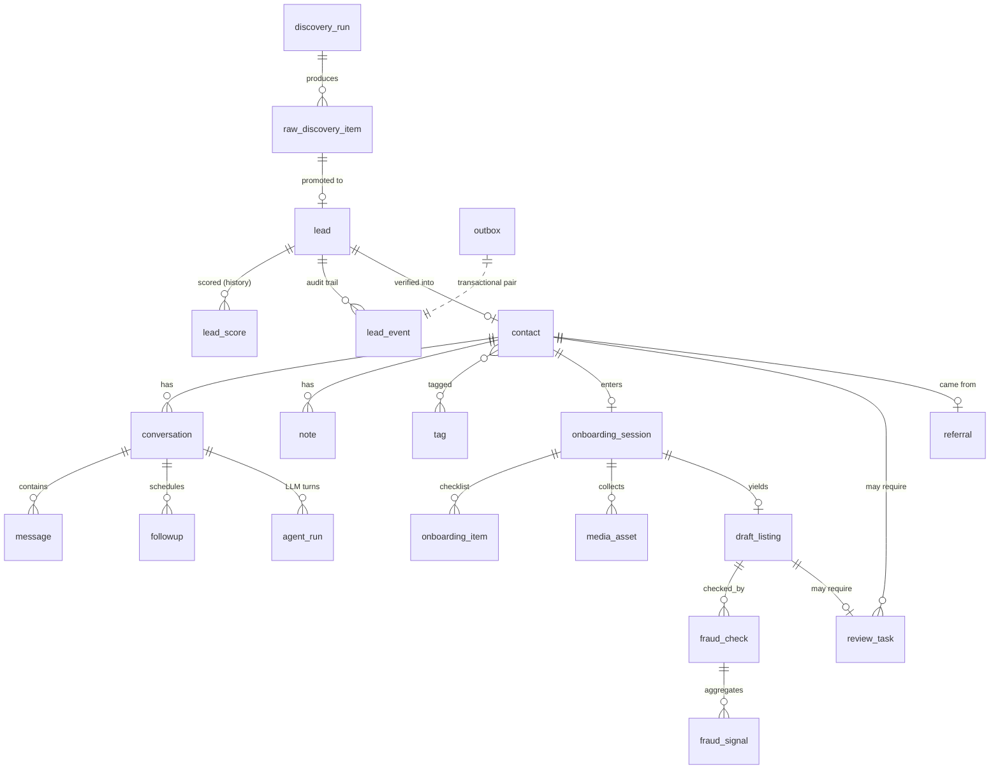

# 02 — Database Design

## 1. Placement and conventions

- **Same Neon Postgres cluster** as the marketplace, dedicated schema **`acq`**. One cluster = one backup story, one connection budget, cheap joins for analytics; a separate schema = clean blast-radius and permission boundary (`acq_rw` role cannot touch `public` except two whitelisted publish functions).
- **No cross-schema foreign keys.** HAS references marketplace rows (`User.id`, `Listing.id`) by value in `marketplace_user_id` / `marketplace_listing_id` columns. Publish is performed by a `SECURITY DEFINER` function pair (`publish_host()`, `publish_listing()`) owned by a migration role — the only doorway between schemas.
- IDs: `text` cuid2 (matches marketplace convention). Timestamps: `timestamptz`, all times UTC. Money: integer qəpik (AZN×100). Enums: Postgres enums for closed sets that gate logic; `text + CHECK` for sets that grow (tags, sources).
- Prisma: second schema file (`prisma/acq.prisma`) with `multiSchema` preview or a dedicated client; migrations run with `directUrl` (no pooler) exactly like the marketplace.

## 2. Entity-relationship overview



## 3. DDL — every table

> Written as executable Postgres DDL; Prisma models mirror 1:1. `-- idx:` lines call out the index rationale.

### 3.1 Discovery

```sql
CREATE TYPE acq.source_kind AS ENUM
  ('google_places','instagram','ctwa','referral','tourism_registry','ops_import','inbound_web','other');

CREATE TABLE acq.discovery_run (
  id            text PRIMARY KEY,
  source        acq.source_kind NOT NULL,
  region        text,                          -- e.g. 'Qəbələ'
  params        jsonb NOT NULL DEFAULT '{}',   -- query terms, page tokens
  status        text NOT NULL DEFAULT 'running' CHECK (status IN ('running','done','failed')),
  items_found   int  NOT NULL DEFAULT 0,
  cost_cents    int  NOT NULL DEFAULT 0,       -- API cost attribution (USD cents)
  started_at    timestamptz NOT NULL DEFAULT now(),
  finished_at   timestamptz,
  error         text
);
-- idx: dashboard "runs by source over time"
CREATE INDEX ON acq.discovery_run (source, started_at DESC);

CREATE TABLE acq.raw_discovery_item (
  id            text PRIMARY KEY,
  run_id        text NOT NULL REFERENCES acq.discovery_run(id),
  source        acq.source_kind NOT NULL,
  external_key  text NOT NULL,                 -- place_id / ig username / url hash
  payload       jsonb NOT NULL,                -- raw source payload
  purge_after   timestamptz,                   -- ToS retention (Google: 30d) — nulled fields after purge
  lead_id       text,                          -- set when promoted
  created_at    timestamptz NOT NULL DEFAULT now(),
  UNIQUE (source, external_key)                -- idempotent re-discovery
);
-- idx: retention job scan
CREATE INDEX ON acq.raw_discovery_item (purge_after) WHERE purge_after IS NOT NULL;
```

### 3.2 Leads & scoring

```sql
CREATE TYPE acq.lead_stage AS ENUM
  ('discovered','verified','contacted','engaged','qualified','negotiating','nurture',
   'onboarding','listing_ready','published','active_host',
   'rejected','lost','opted_out','blacklisted');

CREATE TABLE acq.lead (
  id              text PRIMARY KEY,
  stage           acq.lead_stage NOT NULL DEFAULT 'discovered',
  source          acq.source_kind NOT NULL,
  source_item_id  text REFERENCES acq.raw_discovery_item(id),
  display_name    text,
  phone_e164      text,                        -- normalized; NULL until known
  region          text,
  property_type   text,                        -- ev | villa | dağ evi | mənzil | guesthouse ...
  owner_kind      text CHECK (owner_kind IN ('owner','agency','hotel','unknown')) DEFAULT 'unknown',
  dedupe_cluster  text,                        -- cluster id linking suspected duplicates
  name_embedding  vector(1024),                -- pgvector; name+region+bio embedding for fuzzy dedupe
  attributes      jsonb NOT NULL DEFAULT '{}', -- source-specific extras (ig followers, registry license)
  rejected_reason text,
  created_at      timestamptz NOT NULL DEFAULT now(),
  updated_at      timestamptz NOT NULL DEFAULT now()
);
-- idx: exact-dupe check is the hottest verification path
CREATE UNIQUE INDEX lead_phone_unique ON acq.lead (phone_e164) WHERE phone_e164 IS NOT NULL;
-- idx: funnel queries "leads in stage X by region"
CREATE INDEX ON acq.lead (stage, region, updated_at DESC);
-- idx: fuzzy name dedupe (pg_trgm)
CREATE INDEX lead_name_trgm ON acq.lead USING gin (display_name gin_trgm_ops);
-- idx: embedding dedupe (pgvector HNSW)
CREATE INDEX lead_embedding_hnsw ON acq.lead USING hnsw (name_embedding vector_cosine_ops);

CREATE TABLE acq.lead_score (
  id             text PRIMARY KEY,
  lead_id        text NOT NULL REFERENCES acq.lead(id),
  score          smallint NOT NULL CHECK (score BETWEEN 0 AND 100),
  features       jsonb NOT NULL,               -- each feature value + weight (explainable)
  model_version  text NOT NULL,                -- scorer version for backtesting
  created_at     timestamptz NOT NULL DEFAULT now()
);
CREATE INDEX ON acq.lead_score (lead_id, created_at DESC);

-- Append-only audit of every stage change / significant action (CRM timeline)
CREATE TABLE acq.lead_event (
  id          text PRIMARY KEY,
  lead_id     text NOT NULL REFERENCES acq.lead(id),
  type        text NOT NULL,                   -- stage_changed | scored | outreach_sent | ...
  actor       text NOT NULL,                   -- 'system' | 'agent:conversation' | 'ops:<userId>'
  data        jsonb NOT NULL DEFAULT '{}',
  created_at  timestamptz NOT NULL DEFAULT now()
);
CREATE INDEX ON acq.lead_event (lead_id, created_at DESC);
```

### 3.3 CRM: contacts, tags, notes, follow-ups

```sql
CREATE TABLE acq.contact (
  id                    text PRIMARY KEY,
  lead_id               text NOT NULL UNIQUE REFERENCES acq.lead(id),
  phone_e164            text NOT NULL,
  wa_id                 text,                  -- WhatsApp id once known
  wa_capable            boolean,               -- NULL=unknown
  preferred_name        text,                  -- how they asked to be addressed
  language              text NOT NULL DEFAULT 'az',
  opt_in_status         text NOT NULL DEFAULT 'none'
                        CHECK (opt_in_status IN ('none','implied_ctwa','explicit','revoked')),
  opt_in_evidence       jsonb,                 -- when/how consent was recorded (auditable)
  marketplace_user_id   text,                  -- set after host account created
  risk_score            smallint NOT NULL DEFAULT 0 CHECK (risk_score BETWEEN 0 AND 100),
  lifetime_revenue_qepik bigint NOT NULL DEFAULT 0, -- denormalized from marketplace, nightly sync
  timezone              text NOT NULL DEFAULT 'Asia/Baku',
  created_at            timestamptz NOT NULL DEFAULT now(),
  updated_at            timestamptz NOT NULL DEFAULT now()
);
CREATE UNIQUE INDEX ON acq.contact (phone_e164);
CREATE INDEX ON acq.contact (wa_id) WHERE wa_id IS NOT NULL;
CREATE INDEX ON acq.contact (marketplace_user_id) WHERE marketplace_user_id IS NOT NULL;
-- idx: risk dashboards
CREATE INDEX ON acq.contact (risk_score DESC) WHERE risk_score >= 40;

CREATE TABLE acq.tag (
  id    text PRIMARY KEY,
  name  text NOT NULL UNIQUE,                  -- 'seaside','premium','agency-suspect','vip'
  kind  text NOT NULL DEFAULT 'manual' CHECK (kind IN ('manual','auto'))
);
CREATE TABLE acq.contact_tag (
  contact_id text NOT NULL REFERENCES acq.contact(id) ON DELETE CASCADE,
  tag_id     text NOT NULL REFERENCES acq.tag(id) ON DELETE CASCADE,
  PRIMARY KEY (contact_id, tag_id)
);

CREATE TABLE acq.note (
  id          text PRIMARY KEY,
  contact_id  text NOT NULL REFERENCES acq.contact(id),
  author      text NOT NULL,                   -- ops user id or 'agent'
  body        text NOT NULL,
  pinned      boolean NOT NULL DEFAULT false,
  created_at  timestamptz NOT NULL DEFAULT now()
);
CREATE INDEX ON acq.note (contact_id, created_at DESC);

CREATE TABLE acq.followup (
  id             text PRIMARY KEY,
  contact_id     text NOT NULL REFERENCES acq.contact(id),
  conversation_id text,
  due_at         timestamptz NOT NULL,
  kind           text NOT NULL,                -- cadence_1 | nurture_seasonal | onboarding_nudge | post_publish_d7 ...
  payload        jsonb NOT NULL DEFAULT '{}',  -- template name, context
  status         text NOT NULL DEFAULT 'scheduled'
                 CHECK (status IN ('scheduled','sent','cancelled','suppressed')),
  created_by     text NOT NULL,                -- 'agent' | 'ops:<id>' | 'system'
  created_at     timestamptz NOT NULL DEFAULT now()
);
-- idx: the follow-up dispatcher scans due work
CREATE INDEX ON acq.followup (status, due_at) WHERE status = 'scheduled';
```

### 3.4 Conversations & messages

```sql
CREATE TABLE acq.conversation (
  id             text PRIMARY KEY,
  contact_id     text NOT NULL REFERENCES acq.contact(id),
  channel        text NOT NULL DEFAULT 'whatsapp' CHECK (channel IN ('whatsapp','sms','call_log')),
  state          text NOT NULL DEFAULT 'active'
                 CHECK (state IN ('active','paused_handoff','human_driving','closed')),
  playbook       text NOT NULL DEFAULT 'sales', -- sales | onboarding | activation | support
  facts          jsonb NOT NULL DEFAULT '{}',   -- structured memory: rooms, price ideas, objections raised...
  service_window_expires_at timestamptz,        -- Meta 24h customer-service window
  ai_paused_until timestamptz,                  -- human takeover timer
  last_inbound_at  timestamptz,
  last_outbound_at timestamptz,
  created_at     timestamptz NOT NULL DEFAULT now(),
  updated_at     timestamptz NOT NULL DEFAULT now()
);
CREATE INDEX ON acq.conversation (contact_id, created_at DESC);
-- idx: "conversations needing attention" ops view
CREATE INDEX ON acq.conversation (state, updated_at DESC) WHERE state <> 'closed';

-- High-volume table → monthly range partitions from day one (cheap in PG15+)
CREATE TABLE acq.message (
  id              text NOT NULL,
  conversation_id text NOT NULL,
  direction       text NOT NULL CHECK (direction IN ('in','out')),
  wamid           text,                        -- WhatsApp message id (dedupe inbound + status join)
  kind            text NOT NULL DEFAULT 'text' -- text | image | audio | video | document | template | location
                  CHECK (kind IN ('text','image','audio','video','document','template','location','interactive')),
  body            text,                        -- text or caption; template name for templates
  media_asset_id  text,
  transcript      text,                        -- STT result for audio
  status          text NOT NULL DEFAULT 'stored'
                  CHECK (status IN ('stored','queued','sent','delivered','read','failed','suppressed')),
  status_detail   text,                        -- WA error code, suppression reason
  agent_run_id    text,                        -- which LLM turn produced this (out only)
  idempotency_key text,                        -- send dedupe
  created_at      timestamptz NOT NULL DEFAULT now(),
  PRIMARY KEY (id, created_at)
) PARTITION BY RANGE (created_at);
CREATE UNIQUE INDEX ON acq.message (wamid, created_at) WHERE wamid IS NOT NULL;
CREATE INDEX ON acq.message (conversation_id, created_at DESC);
CREATE UNIQUE INDEX ON acq.message (idempotency_key, created_at) WHERE idempotency_key IS NOT NULL;
```

### 3.5 Onboarding & media

```sql
CREATE TABLE acq.onboarding_session (
  id           text PRIMARY KEY,
  contact_id   text NOT NULL REFERENCES acq.contact(id),
  state        text NOT NULL DEFAULT 'in_progress'
               CHECK (state IN ('in_progress','stalled','completed','abandoned')),
  property_type text,
  checklist_version text NOT NULL,
  started_at   timestamptz NOT NULL DEFAULT now(),
  completed_at timestamptz,
  updated_at   timestamptz NOT NULL DEFAULT now()
);
CREATE INDEX ON acq.onboarding_session (state, updated_at) WHERE state = 'in_progress';

CREATE TABLE acq.onboarding_item (
  id           text PRIMARY KEY,
  session_id   text NOT NULL REFERENCES acq.onboarding_session(id) ON DELETE CASCADE,
  key          text NOT NULL,      -- photos | location | amenities | pricing | availability |
                                   -- house_rules | identity | bank | tax
  required     boolean NOT NULL DEFAULT true,
  status       text NOT NULL DEFAULT 'pending'
               CHECK (status IN ('pending','collected','verified','waived','failed')),
  value        jsonb,              -- collected structured value
  verified_by  text,               -- 'system' | 'ops:<id>' (identity/bank ⇒ ops in v1)
  updated_at   timestamptz NOT NULL DEFAULT now(),
  UNIQUE (session_id, key)
);

CREATE TABLE acq.media_asset (
  id            text PRIMARY KEY,
  contact_id    text NOT NULL REFERENCES acq.contact(id),
  session_id    text REFERENCES acq.onboarding_session(id),
  kind          text NOT NULL CHECK (kind IN ('photo','document','audio','video')),
  blob_url      text NOT NULL,                 -- private-store URL (docs NEVER public bucket)
  sensitive     boolean NOT NULL DEFAULT false, -- identity docs, bank proofs
  sha256        text NOT NULL,
  phash         bit(64),                       -- perceptual hash for near-dup detection
  clip_embedding vector(512),                  -- image embedding for semantic dupe search
  exif_stripped boolean NOT NULL DEFAULT false,
  quality       jsonb,                         -- {score, blur, exposure, resolution, room_type}
  created_at    timestamptz NOT NULL DEFAULT now()
);
CREATE UNIQUE INDEX ON acq.media_asset (sha256, contact_id);   -- exact-dup per contact
CREATE INDEX media_phash_idx ON acq.media_asset USING gist (phash);  -- bktree ext; else app-side BK-tree
CREATE INDEX media_clip_hnsw ON acq.media_asset USING hnsw (clip_embedding vector_cosine_ops);
```

### 3.6 Draft listings, fraud, review

```sql
CREATE TABLE acq.draft_listing (
  id             text PRIMARY KEY,
  session_id     text NOT NULL UNIQUE REFERENCES acq.onboarding_session(id),
  contact_id     text NOT NULL REFERENCES acq.contact(id),
  content        jsonb NOT NULL,     -- {title, description, seo:{slug,meta}, amenities[], nearby[],
                                     --  house_rules, price_qepik, price_band:{lo,hi}, photos:[asset ids ordered]}
  gen_model      text NOT NULL,      -- e.g. 'claude-sonnet-5'
  content_version int NOT NULL DEFAULT 1,
  status         text NOT NULL DEFAULT 'draft'
                 CHECK (status IN ('draft','fraud_pending','approved','needs_review','rejected','published')),
  confidence     smallint,           -- composite 0–100, computed by publish gate
  marketplace_listing_id text,       -- set on publish (idempotency anchor)
  created_at     timestamptz NOT NULL DEFAULT now(),
  updated_at     timestamptz NOT NULL DEFAULT now()
);
CREATE INDEX ON acq.draft_listing (status, updated_at);

CREATE TABLE acq.fraud_check (
  id           text PRIMARY KEY,
  draft_id     text NOT NULL REFERENCES acq.draft_listing(id),
  verdict      text CHECK (verdict IN ('pass','flag','fail')),
  risk_score   smallint CHECK (risk_score BETWEEN 0 AND 100),
  rationale    text,                 -- adjudicator explanation (shown to reviewer)
  model        text,                 -- 'claude-opus-4-8' or 'rules-only'
  created_at   timestamptz NOT NULL DEFAULT now()
);
CREATE INDEX ON acq.fraud_check (draft_id, created_at DESC);

CREATE TABLE acq.fraud_signal (
  id         text PRIMARY KEY,
  check_id   text NOT NULL REFERENCES acq.fraud_check(id) ON DELETE CASCADE,
  kind       text NOT NULL,          -- photo_dup | desc_copy | price_anomaly | phone_voip |
                                     -- blacklist_match | multi_account | geo_mismatch
  severity   smallint NOT NULL CHECK (severity BETWEEN 1 AND 5),
  evidence   jsonb NOT NULL          -- e.g. {matched_listing_id, cosine: 0.97}
);
CREATE INDEX ON acq.fraud_signal (kind, severity);

CREATE TABLE acq.blacklist (
  id         text PRIMARY KEY,
  kind       text NOT NULL CHECK (kind IN ('phone','wa_id','iban','name','device')),
  value_hash text NOT NULL,          -- salted hash; raw PII not stored here
  reason     text NOT NULL,
  source     text NOT NULL,          -- 'fraud_team' | 'chargeback' | 'auto'
  expires_at timestamptz,            -- NULL = permanent
  created_at timestamptz NOT NULL DEFAULT now(),
  UNIQUE (kind, value_hash)
);

CREATE TABLE acq.review_task (
  id          text PRIMARY KEY,
  kind        text NOT NULL,         -- publish_gate | identity | payout | handoff | fraud_flag | ops_import
  subject_type text NOT NULL,        -- draft_listing | contact | conversation
  subject_id  text NOT NULL,
  priority    smallint NOT NULL DEFAULT 3 CHECK (priority BETWEEN 1 AND 5),
  status      text NOT NULL DEFAULT 'open'
              CHECK (status IN ('open','claimed','approved','rejected','expired')),
  context     jsonb NOT NULL DEFAULT '{}',  -- confidence breakdown, fraud rationale, links
  claimed_by  text,
  resolved_by text,
  resolution_note text,
  sla_due_at  timestamptz NOT NULL,
  created_at  timestamptz NOT NULL DEFAULT now(),
  resolved_at timestamptz
);
-- idx: the review inbox
CREATE INDEX ON acq.review_task (status, priority, sla_due_at) WHERE status IN ('open','claimed');
```

### 3.7 Referrals

```sql
CREATE TABLE acq.referral (
  id                text PRIMARY KEY,
  referrer_user_id  text NOT NULL,        -- marketplace User.id (existing host)
  code              text NOT NULL UNIQUE, -- short code in link/QR
  referee_contact_id text REFERENCES acq.contact(id),
  status            text NOT NULL DEFAULT 'created'
                    CHECK (status IN ('created','clicked','converted','rewarded','void')),
  reward_qepik      int,
  rewarded_at       timestamptz,
  created_at        timestamptz NOT NULL DEFAULT now()
);
CREATE INDEX ON acq.referral (referrer_user_id, status);
```

### 3.8 AI operations & cost

```sql
-- One row per LLM invocation. THE debugging + cost + eval backbone.
CREATE TABLE acq.agent_run (
  id             text NOT NULL,
  agent          text NOT NULL,        -- conversation | verifier | listing_gen | fraud_adjudicator | photo_qa | qa_sampler
  model          text NOT NULL,
  conversation_id text,
  subject_id     text,                 -- lead/draft id depending on agent
  trace_id       text,                 -- OTel trace
  input_tokens   int NOT NULL,
  output_tokens  int NOT NULL,
  cache_read_tokens int NOT NULL DEFAULT 0,
  cost_microusd  bigint NOT NULL,      -- computed at write time from price table
  latency_ms     int NOT NULL,
  stop_reason    text,
  tool_calls     jsonb,                -- names + args hash (not full payloads)
  confidence     smallint,             -- agent-reported, where applicable
  flagged        boolean NOT NULL DEFAULT false,  -- QA sampler mark
  created_at     timestamptz NOT NULL DEFAULT now(),
  PRIMARY KEY (id, created_at)
) PARTITION BY RANGE (created_at);
CREATE INDEX ON acq.agent_run (agent, created_at DESC);
CREATE INDEX ON acq.agent_run (conversation_id, created_at) WHERE conversation_id IS NOT NULL;

CREATE TABLE acq.llm_price (
  model          text PRIMARY KEY,
  input_per_mtok_microusd  bigint NOT NULL,
  output_per_mtok_microusd bigint NOT NULL,
  cache_read_per_mtok_microusd bigint NOT NULL,
  effective_from timestamptz NOT NULL
);
```

### 3.9 Eventing, webhooks, analytics

```sql
CREATE TABLE acq.outbox (
  id           bigserial PRIMARY KEY,
  event_id     text NOT NULL UNIQUE,       -- cuid; consumers dedupe on this
  topic        text NOT NULL,              -- 'verify.lead.requested' ...
  payload      jsonb NOT NULL,
  created_at   timestamptz NOT NULL DEFAULT now(),
  relayed_at   timestamptz
);
-- idx: relay scans unrelayed head
CREATE INDEX ON acq.outbox (id) WHERE relayed_at IS NULL;

-- Inbound webhook dedupe + replay buffer
CREATE TABLE acq.webhook_event (
  id           text PRIMARY KEY,           -- provider event id (wamid / meta event id)
  provider     text NOT NULL,              -- whatsapp | meta_ads
  kind         text NOT NULL,
  payload      jsonb NOT NULL,
  processed_at timestamptz,
  received_at  timestamptz NOT NULL DEFAULT now()
);
CREATE INDEX ON acq.webhook_event (provider, received_at DESC);

CREATE TABLE acq.consumed_event (          -- consumer-side exactly-once ledger
  consumer   text NOT NULL,
  event_id   text NOT NULL,
  consumed_at timestamptz NOT NULL DEFAULT now(),
  PRIMARY KEY (consumer, event_id)
);

-- Append-only analytics facts (funnel + product events)
CREATE TABLE acq.analytics_event (
  id         bigserial,
  name       text NOT NULL,                -- lead_verified | wa_reply | stage_change | published | ...
  contact_id text,
  lead_id    text,
  props      jsonb NOT NULL DEFAULT '{}',
  created_at timestamptz NOT NULL DEFAULT now(),
  PRIMARY KEY (id, created_at)
) PARTITION BY RANGE (created_at);
CREATE INDEX ON acq.analytics_event (name, created_at);

-- Nightly-refreshed rollup powering the dashboard (11 metrics of Phase 10)
CREATE MATERIALIZED VIEW acq.metrics_daily AS
SELECT
  date_trunc('day', created_at) AS day,
  count(*) FILTER (WHERE name = 'lead_discovered')             AS daily_leads,
  count(*) FILTER (WHERE name = 'lead_qualified')              AS qualified_leads,
  count(*) FILTER (WHERE name = 'published')                   AS published,
  count(*) FILTER (WHERE name = 'first_booking')               AS activated_hosts
FROM acq.analytics_event
GROUP BY 1;
-- Conversion, response-time, cost/ROI views are defined alongside (see 06 §5 for the read API);
-- response time = avg(first out.created_at - in.created_at) per conversation/day from acq.message.

CREATE TABLE acq.config (                  -- kill-switches & tunables, hot-reloaded
  key        text PRIMARY KEY,             -- 'sends.enabled', 'autopublish.enabled', 'discovery.google.enabled',
                                           -- 'quiet_hours', 'followup_cadence', 'confidence_threshold'
  value      jsonb NOT NULL,
  updated_by text NOT NULL,
  updated_at timestamptz NOT NULL DEFAULT now()
);
```

## 4. Relationships to marketplace schema

| HAS column | Marketplace target | Written when |
|---|---|---|
| `contact.marketplace_user_id` | `public.User.id` | host account created at onboarding completion (phone-auth user, role `host`) |
| `draft_listing.marketplace_listing_id` | `public.Listing.id` | publish; `Listing.status='approved'`, `ownerId` set |
| `contact.lifetime_revenue_qepik` | derived from `public.Booking`/`Payout` | nightly sync job |
| `referral.referrer_user_id` | `public.User.id` | referral link generation |

Publish idempotency: `publish_listing()` takes `draft_id`, checks `marketplace_listing_id IS NULL` under `SELECT … FOR UPDATE`, creates the listing, stamps the draft — safe under retry.

## 5. Performance notes

- **Hot paths**: (1) webhook insert + wamid dedupe — unique partial index, single-row upsert; (2) conversation load — `message (conversation_id, created_at DESC)` + `LIMIT 30`; (3) follow-up dispatcher — partial index on `(status,due_at)`; (4) dedupe — unique phone index first (O(1)), trigram/vector only on miss.
- **Partitioning**: `message`, `agent_run`, `analytics_event` are monthly-partitioned from day one; partitions auto-created by a cron. Everything else is small (≤ millions of rows) for years.
- **pgvector sizing**: HNSW indexes stay in memory at our scale (100k leads × 1 KB ≈ 100 MB) — fine on Neon; revisit if lead corpus > 5 M.
- **Connection budget**: workers use the pooled `DATABASE_URL` (PgBouncer) with per-process pool ≤ 5; migrations and the outbox relay use `DIRECT_URL`.
- **Retention**: raw payloads purged per `purge_after`; messages ≥ 24 months archived to blob parquet then dropped by partition; identity docs deleted 30 days after verification decision (only verification result retained). Full policy in 08 §6.
